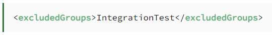

# TestAssignment2

## Table of Contents
[1. Refelctions](#1-reflections)
  - [1.1 - Computer Mouse](#11---computer-mouse)
  - [1.2 - Catastrophic Failure](#12---catastrophic-failure)

[3. Investigation of Tools](#3-investigation-of-tools)
  - [3.1 - JUnit5](#31---junit5)
    - [3.1.1 - <b>@Tag</b>](#311---tag)

## 1. Reflections
### 1.1 - Computer Mouse

#### BDD:
- The speed - how fast can you hit a specific point on the screen?
  - Given: a cursor, a timer and a point
  - When: timer starts
  - Then: count until cursor hits point
- The Accuracy - can you hit a specific point on the screen? is it calibrated
  - Given: A cursor and a point
  - When: Mouse is clicked
  - Then: Check if mouseclick is on point

#### TDD:
- Test the speed - how fast can you hit a specific point on the screen - unit test
- Test the accuracy - how precise and how consistently can you hit a specific point on the screen - unit test

#### Acceptance test:
- The build quality - how much wear and tear can the mouse take before the building material wears off?
- The weight - is the mouse made for the right consumer? is it light enough for e-sport players? does the weight even matter for regular consumers?

### 1.2 - Catastrophic Failure
<i>https://www.jpl.nasa.gov/missions/mariner-1</i>
#### The Mariner 1 Spacecraft, 1962
The Mariner 1 space probe barely made it out of Cape Canaveral before the rocket veered dangerously off course. Worried that the rocket was heading towards a crash-landing on earth, NASA engineers issued a self-destruct command and the craft was obliterated about 290 seconds after launch.

An investigation revealed the cause to be a very simple software error. A hyphen (-) was omitted (missing) in a line of code, which meant that incorrect guidance signals were sent to the spacecraft. The overall cost of the omission was reported to be more than $18 million at the time (about $169 million in today’s world).

#### BDD:
- Test Signals:
  - Given: A set of specific guidance signals to keep the rocket flying upright
  - When: Spacecraft receives the guidance signals
  - Then: The spacecraft stays on course

#### TDD:
- Test about the correct signal - unit

## 3. Investigation of Tools
### 3.1 - JUnit5

#### 3.1.1 - @Tag
JUnit 5 @Tag  
Annotation JUnit Tests with Tag 
With JUnit 5 we can filter tests by tagging a subset of them under a unique tag name. For example, suppose we have both unit tests and integration tests implemented using JUnit 5. We can add tags on both sets of test cases: 

Henceforth we can execute all tests under a particular tag name separately. We can also tag the class instead of methods. Thereby including all tests in a class under a tag.  
 
Can also use Filtering Tags with Maven Surefire plugin  
For filtering JUnit tests within the various phases of the Maven build, we can use the Maven Surefire plugin. The Surefire plugin allows us to include or exclude the tags in the plugin configuration:

If we now execute this plugin, it will execute all tests which are tagged as UnitTest. Similarly, we can exclude test cases under a tag name:

JUnit 5 allows various <a href="https://junit.org/junit5/docs/current/user-guide/#running-tests-tag-expressions">Tag Expressions</a> which can be used to filter the tags. For example, to run everything but the integration tests, we could use <i>!IntegrationTest</i> as the Tag Expression. Or for executing both <i>UnitTest</i> and <i>IntegrationTest</i>, we can use <i>UnitTest</i> | <i>IntegrationTest</i>.

#### 3.1.2 - @Disabled
JUnit 5 @Disabled annotation can be used to exclude the test methods from the test suite. This annotation can be applied over a test class as well as over individual test methods.  

It accepts only one optional parameter, which indicates the reason this test is disabled. 

When @Disabled is applied over test class, all test methods within that class are automatically disabled as well.

Here both tests are skipped because the whole class is @Disabled.

When this is executed there will only be 1 test because the other one is @Disabled

#### 3.1.3 - @RepeatedTest
JUnit 5 @RepeatedTest annotation 

It provides us a powerful way to write any test that we want to repeat several times. 

Creating a repeated test is simple – just add the @RepeatedTest annotation on top of the test method: 

Note that instead of standard @Test annotation, we are using @RepeatedTest for our unit test. The above test will be executed three times as if the same test was written three times.

#### 3.1.4 - @BeforeEach, @AfterEach
Each execution of the @RepeatedTest will behave like a regular @Test having full JUnit test life cycle support. Meaning that, during each execution, the @BeforeEach and @AfterEach methods will be called. To demonstrate this, just add the appropriate methods in the test class:

If we run our previous test, the results will be displayed on the console:

As we can see, the @BeforeEach and @AfterEach methods are called around each execution.

#### 3.1.5 - @BeforeAll, @AfterAll
BeforeAll and AfterAll is used to instantiate something that all the tests can use. For instance if we want to test POST, UPDATE and DELETE to a database then the BeforeAll can do the connection and AfterAll can delete the tested tables. 
Let's say we want to test if we can put a person object into the database, then change the person's name, and finally kill the person then that one person is in focus and therefore we don't need to connect to a database every test. We only need to connect once, do our changes, and then delete the table or database AfterAll tests. 

#### 3.1.6 - @DisplayName
A test’s default name is the name of the test:

Instead we can give them a new name with DisplayName:

You could also use something called a DisplayNameGenerator to change the names in different ways. For instance in this example we call the function ReplaceUnderscores.class on the DisplayNameGenerator object, and the test names would then be “test spaces ok” instead of “test_spaces_ok”:

#### 3.1.7 - @Nested
The Nested test anotation means that we can create a new test class inside a test class. There is no limit of how far the hieraki can go. The BeforeAll and AfterAll can not be used in a nested test class because they are static and a nested test doesn’t allow static content. By default a nested class can only contain one BeforeEach and one AfterEach.

#### 3.1.8 - assumeFalse, assumeTrue
These assumptions are used to about a tests if some conditions aren’t true or false. Fx this test should only run if the environment if DEV:

